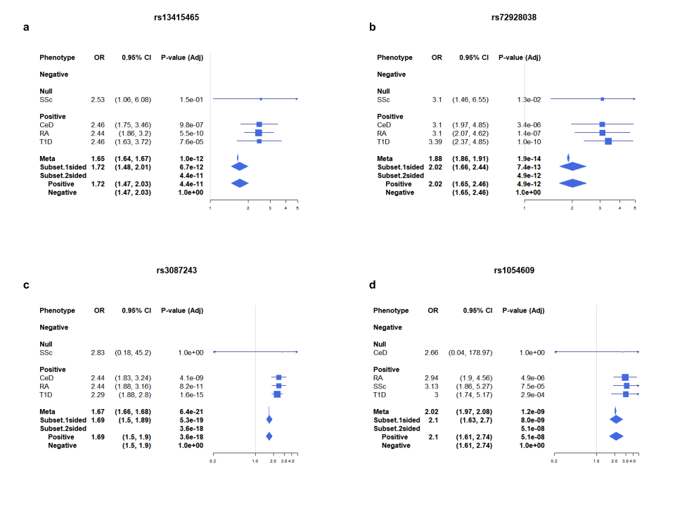
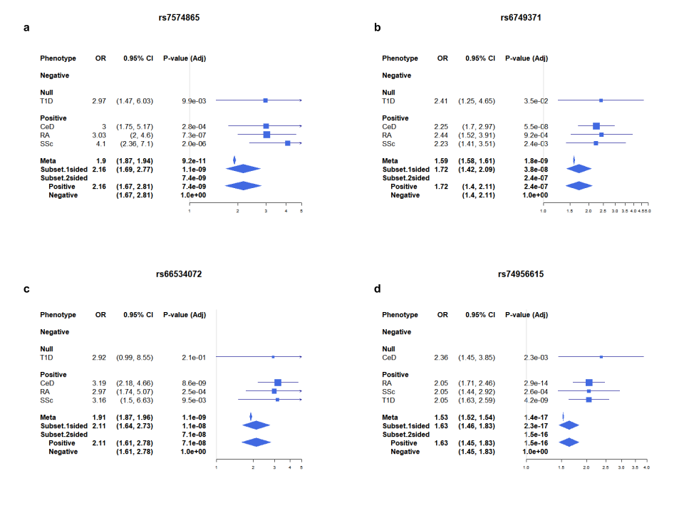

```{r setup, include=FALSE}
knitr::opts_chunk$set(echo = TRUE)
```

## Background

  Autoimmunity is the term used to describe conditions that arise from the immune system inappropriately attacking the body. The mechanisms behind autoimmunity are still relatively unknown. There are many components involved with autoimmunity that interact with each other which can increase or decrease one’s susceptibility to dysfunctions of the immune system. Environment, gender, and genetics all contribute to an inappropriate attack and destruction of the body’s tissues caused by the immune system. Nevertheless, there are commonalities shared between the diverse autoimmune diseases. One such shared trait is the observation that multiple autoimmune diseases sometimes appear among family members, a phenomenon known as “familial aggregation”. Another shared trait is the condition known as polyautoimmunity. Polyautoimmunity describes a condition where an individual exhibits multiple diseases. 
  
  These shared features suggest that there is an underlying genetic component behind autoimmunity. The goal of this project was to check for the association of genetic single-nucleotide polymorphisms (SNPs) among the autoimmune diseases: Celiac Disease (CeD), Rheumatoid Arthritis (RA), Systematic Sclerosis (SSc), and Type 1 Diabetes (T1D) using the genetic data from the meta-analysis performed by Marquez et al. (2018). Association was determined through a heterogeneous two-sided subset analysis created through the R package "ASSET" (Bhattacharjee et al, 2012).


## Methods and Materials

The samples were retrieved from multiple studies where the genetic data was genotyped with Immunochip (Illumina,Inc., CA), "a custom array designed for dense genotyping of 186 established genome-wide significant loci" (Marquez et al., 2018). 

### Quality Control 

Marquez et al. (2018) performed different data quality control methods before using the data for analysis including the removal of SNPs with low call rates, randomly discarding an individual of each pair of duplicates and first-degree relatives, etc. The resulting quality control data was the data utilized within this project. 

During the course of this project, the quality control data was filtered into relevant information and formatted into a form that could be loaded into R. That cleaned data was then cleaned further within R so it could be used for analysis. 

```{r, message=FALSE, warning=FALSE, results="hide"}
##################################################
#   This script loads and cleans the raw data    #
#   and saves the clean data set.                #
#                                                #
#   Author: Emily Naylor - Nov 25, 2020          #
#                                                #
##################################################

## Load packages ##
library(tidyverse)
library(janitor)

## Load in the cleaned excel file ##
dat <- read.csv("Data/SNP_meta_data_cleaned_excel.csv")

## Inspect data set ##
glimpse(dat)
names(dat)

## Clean the names ##
names(dat) <-janitor::make_clean_names(names(dat))

## Check the names ##
names(dat)

## Sub-set data for the two-sided subset-based meta-analysis ##
## of the heterogenous disease meta-analyses ##
# See ASSET_manual_examples.R: Heterogeneous traits or studies or the ASSET Vignette online for more information #

## Finding the SE from p-values and Z-score ##
 dat <-dat %>%
   mutate(se=abs(or/qnorm(p)))

## Create new subsetted datasets with the standard error and the odds ratio ##
## In order to pivot them wider ##
 
# Create the OR data-subset
 OR <- dat %>%
   select(-c("se", "p", "maf_cases", "maf_ctrls")) %>%
   pivot_wider(names_from = meta_analysis_disease,
               values_from = or)
 
# Adjust names 
 colnames(OR)[7:10] <- paste(colnames(OR)[7:10], "Beta", sep = ".")

# Create the SE data-subset
 SE <- dat %>%
   select(-c("or", "p", "maf_cases", "maf_ctrls")) %>%
   pivot_wider(names_from = meta_analysis_disease,
               values_from = se)
 
 # Adjust names 
 colnames(SE)[7:10] <- paste(colnames(SE)[7:10], "SE", sep = ".")

 ## Combine the subsets together to create a new data frame ##
 ## that will have the SE and OR by disease ##
 
 full_dat <- full_join(OR,SE)
 
## Save the cleaned data, "Data/SNP_Data_Organized.csv" ##
 write.csv(full_dat, "Data/SNP_Data_Organized.csv", row.names = FALSE)
 
```

### Case Control Matrices 

In order to perform a a heterogeneous two-sided subset analysis, three matrices of the shared samples between the diseases needs to be created. One matrix labeled N00 for shared control samples, another matrix labeled N11 for shared case samples, and a final matrix labeled N10 for shared samples that were used as a control for one of the diseases and a case for the other. The numbers of case and control samples were retrieved from the quality control raw data of Marquez et al. (2018).

```{r, message=FALSE, warning=FALSE, results="hide"}
##################################################
#   This script creates a case-control overlap   #
#     matrices based on the number of controls   #
#     and cases.                                 #
#                                                #
#   Author: Emily Naylor - Dec 7, 2020           #
#                                                #
##################################################


## Numbers for the matrices can be found in "Data/snp_data_raw.xlsx" on the first sheet ##

## Control Matrix 
## number of controls shared for Celiac Disease ##
CeDctrl <- c(13902,12628,13896,9416)
        #CeD    RA    SSc  T1D    
## number of control shared for Rheumatoid Arthritis ##
RActrl <- c(12628,19862,12623,9416)
        #CeD   RA    SSc   T1D
## number of control shared for Systemic Sclerosis ##
SScctrl <- c(13896,12623,15067,9411)
        #CeD   RA    SSc   T1D
## number of control shared for Type 1 Diabetes ##
T1Dctrl <- c(9416,9416,9411,9416)
         #CeD  RA  SSc  T1D

## Create a matrix ##
cntrl <- rbind(CeDctrl,RActrl,SScctrl,T1Dctrl)

## Change the column names ##
colnames(cntrl) <- c("CeD","RA","SSc","T1D")
rownames(cntrl) <- c("CeD","RA","SSc","T1D")

## Export the control matrix ##
write.table(cntrl,file="Data/control_matrix.txt")


## Case Matrix ##
## Control Matrix 
## number of controls shared for Celiac Disease ##
CeDcs <- c(11489,0,0,0)
   
## number of control shared for Rheumatoid Arthritis ##
RAcs <- c(0,15523,0,0)

## number of control shared for Systemic Sclerosis ##
SSccs <- c(0,0,3477,0)

## number of control shared for Type 1 Diabetes ##
T1Dcs <- c(0,0,0,7670)

## Create a matrix ##
case <- rbind(CeDcs,RAcs,SSccs,T1Dcs)

## Change the column names ##
colnames(case) <- c("CeD","RA","SSc","T1D")
rownames(case) <- c("CeD","RA","SSc","T1D")

## Export the control matrix ##
write.table(case,file="Data/case_matrix.txt")


## Case/Control Matrix ##
## number of cases/controls shared for Celiac Disease ##
CeD <- c(0,0,0,0)

## number of cases/controls shared for Rheumatoid Arthritis ##
RA <- c(0,0,0,0)

## number of cases/controls shared for Systemic Sclerosis ##
SSc <- c(0,0,0,0)

## number of cases/controls shared for Type 1 Diabetes ##
T1D <- c(0,0,0,0)

## Create a matrix ##
case_ctrl <- rbind(CeD,RA,SSc,T1D)

## Change the column names ##
colnames(case_ctrl) <- c("CeD","RA","SSc","T1D")
rownames(case_ctrl) <- c("CeD","RA","SSc","T1D")

## Export the case/control matrix ##
write.table(case_ctrl,file="Data/case_control_matrix.txt")
```

### Heterogeneous Two-sided Subset Analysis 

The heterogeneous two-sided subset analysis known as "h.trait" from ASSET was created for combining the positive and negative association signals across various studies using a chi-square statistic.It also corrects for any correlation due to overlap between shared subjects. The analysis returns the p value and the best subset which contains the studies contributing to the overall association signal. 

```{r, message=FALSE, warning=FALSE, results="hide"}
##################################################
#   This script performs a heterogeneous         #
#   two-sided subset analysis using the          #
#   package ASSET                                #
#                                                #
#   Author: Emily Naylor - Dec 7, 2020           #
#                                                #
##################################################

## Load the package ASSET ##
library("ASSET")
library(tidyverse)
library(patchwork)


## Load in the data "Data/SNP_Data_Organized.csv" ##
df <- read.csv("Data/SNP_Data_Organized.csv")

## Load in the Control Matrix ##
N00 <- read.table("Data/control_matrix.txt")
## Load in Case Matrix ##
N11 <- read.table("Data/case_matrix.txt")
## Load in Case/Control Matrix ##
N10 <- read.table("Data/case_control_matrix.txt") 

## Change it into a matrix ##
N00 <- as.matrix(N00)
N11 <- as.matrix(N11)
N10 <- as.matrix(N10)

## Define the input arguments for the h.trait analysis ##
snps <- as.vector(df[, "snp"])
traits.lab <- paste(c("CeD","RA","SSc","T1D"))
beta.hat <- as.matrix(df[, paste(traits.lab, ".Beta", sep="")])
sigma.hat <- as.matrix(df[, paste(traits.lab, ".SE", sep="")])
cor <- list(N11=N11, N00=N00, N10=N10)
ncase <- diag(N11)
ncntl <- diag(N00)

## Perform a heterogeneous two-sided subset analysis ##
res <- h.traits(snps, traits.lab, beta.hat, sigma.hat, ncase=ncase,
                ncntl=ncntl, cor=cor, cor.numr=FALSE, search=NULL,
                side=2, meta=TRUE, zmax.args=NULL)

## Analysis summary ##
h.summary(res)
sum <- h.summary(res)

## Export the analysis results ##
write.csv(sum,file="Data/h_trait_analysis.csv",row.names = FALSE)
```
  
## Results

The SNPs with associations to at least 3 of the autoimmune diseases and a p-value of less than 0.05 were selected for significance. 

**TABLE 1**
SNPs with a positive association to at least 3 of the autoimmune diseases (CeD,RA,SSc,T1D). Only SNPs with a p-value of less than 0.05. The SNPs, p-value, odds-ratio, confidence interval, the diseases the SNP was positively associated with, the region of the SNP, the chromosome where the SNP is located, the position of the base pair change, the changed nucleotide, and the gene of the SNP are displayed below.   
```{r,message=FALSE}
## Extracting the SNPs that had significant associations 
## with at least 3 of the diseases ##

## retrieve the 1 sided subset ##
sd1 <- sum$Subset.1sided

## select SNPs with 3 or more traits association ##
disease3 <- filter(sd1,Pheno == "CeD,RA,SSc,T1D" | Pheno == "CeD,RA,SSc" |
         Pheno == "CeD,RA,T1D"|Pheno == "CeD,SSc,T1D" |
         Pheno == "RA,SSc,T1D")

## Create a table with the SNP information ##

## Create vector with the SNPs ##
high_SNPS <- disease3$SNP

## filter out the relevant SNPs and data from the original dataset ##
dat <- df %>% dplyr::select("region","chr","position_bp","snp","a1","gene") %>% filter(snp %in% high_SNPS)

## keep SNP variable name the same ##
names(disease3)[names(disease3) == "SNP"] <- "snp"

## join the data together as results##
results <- full_join(disease3,dat,by="snp")

knitr::kable(results,caption = "TABLE 1: SNPs with association to at least 3 autoimmune diseases.", floating.environment="sidewaystable", digits = c(1, 18))
```

```{r, message=FALSE, warning=FALSE, results="hide"}
write.csv(results, file = "Results/Tables/SNP_results.csv")
```  

Forest plots for each of the eight SNPs with an association to a minminum of 3 autoimmune diseases. 

```{r, message=FALSE, warning=FALSE, results="hide", fig.show="hide"}
## Create forest plots for each of the genes with at least 3 disease association ##

## AFF3 ##
h.forestPlot(res, "rs13415465")
dev.copy(png,"Results/Figures//AFF3fplot.png",
         width=8,height=6,units="in",res=100)
dev.off()

## BACH2 ##
h.forestPlot(res, "rs72928038")
dev.copy(png,"Results/Figures//BACH2fplot.png",
         width=8,height=6,units="in",res=100)
dev.off()

## CTLA4 ##
h.forestPlot(res, "rs3087243")
dev.copy(png,"Results/Figures//CTLA4fplot.png",
         width=8,height=6,units="in",res=100)
dev.off()

## ORMDL3 ##
h.forestPlot(res, "rs1054609")
dev.copy(png,"Results/Figures//ORMDL3fplot.png",
         width=8,height=6,units="in",res=100)
dev.off()
```

 
**Figure 1**
Forest Plots showing the effects of the first four SNPs on CeD, RA, SSc, and T1D (see Table 1) The two-sided subset-based test found (a) the SNP of the gene *AFF3* (b)the SNP of the gene *BACH2* and (c) the SNP of the gene *CTLA4* to be positively associated to CeD, RA, and T1D with no association to SSc.(d)The SNP of the gene *ORMDL3* was found to be positively associated with RA, SSc, and T1D with no association to CeD.The p values for overall association with the use of standard meta-analysis, one-sided, and two-sided subset-based tests are shown along with their respective OR estimates at the bottom of the figure.

```{r, message=FALSE, warning=FALSE, results="hide", fig.show="hide"}
## Create forest plots for each of the genes with at least 3 disease association ##

## STAT4 ##
## First SNP ##
h.forestPlot(res, "rs7574865")
dev.copy(png,"Results/Figures//STAT4_1_fplot.png",
         width=8,height=6,units="in",res=100)
dev.off()
## Second SNP ##
h.forestPlot(res, "rs6749371")
dev.copy(png,"Results/Figures//STAT4_2_fplot.png",
         width=8,height=6,units="in",res=100)
dev.off()

## TYK2 ##
h.forestPlot(res, "rs74956615")
dev.copy(png,"Results/Figures//TYK2fplot.png",
         width=8,height=6,units="in",res=100)
dev.off()

## YDJC ##
h.forestPlot(res, "rs66534072")
dev.copy(png,"Results/Figures//YDJCfplot.png",
         width=8,height=6,units="in",res=100)
dev.off()
```

 

**Figure 2**
Forest Plots showing the effects of the first four SNPs on CeD, RA, SSc, and T1D (see Table 1) The two-sided subset-based test found (a & b) the SNPs of the gene *STAT4* and (c) the SNP of the gene *YDJC* to be positively associated to CeD, RA, and SSc with no association to T1D.(d)The SNP of the gene *TYK2* was found to be positively associated with RA, SSc, and T1D with no association to CeD.The p values for overall association with the use of standard meta-analysis, one-sided, and two-sided subset-based tests are shown along with their respective OR estimates at the bottom of the figure.

## Discussion
The seven genes *AFF3*, *BACH2*, *CTLA4*, *ORMDL3*, *STAT4*, *YDJC*, and *TYK2* had SNPs positively associated by the heterogeneous two-sided subset-based test with at least 3 of the autoimmune diseases that were analyzed. What this basically means is that people with one of the autoimmune diseases such as type 1 diabetes is more likely to have one or more of the SNPs such as the *BACH2* SNP. While these results do not directly imply that any of the genes may contribute to an underlying genetic component of autoimmunity, they can serve as possible candidates for further study of their function in autoimmunity or as a potential genetic marker for autoimmunity.  

## References

Bhattacharjee, S., Rajaraman, P., Jacobs, K. B., Wheeler, W. A., Melin, B. S., Hartge, P., GliomaScan Consortium, Yeager, M., Chung, C. C., Chanock, S. J., & Chatterjee, N. (2012). A subset-based approach improves power and interpretation for the combined analysis of genetic association studies of heterogeneous traits. American journal of human genetics, 90(5), 821–835. https://doi.org/10.1016/j.ajhg.2012.03.015

Márquez, A., Kerick, M., Zhernakova, A., Gutierrez-Achury, J., Chen, W. M., Onengut-Gumuscu, S., González-Álvaro, I., Rodriguez-Rodriguez, L., Rios-Fernández, R., González-Gay, M. A., Coeliac Disease Immunochip Consortium, Rheumatoid Arthritis Consortium International for Immunochip (RACI), International Scleroderma Group, Type 1 Diabetes Genetics Consortium, Mayes, M. D., Raychaudhuri, S., Rich, S. S., Wijmenga, C., & Martín, J. (2018). Meta-analysis of Immunochip data of four autoimmune diseases reveals novel single-disease and cross-phenotype associations. Genome medicine, 10(1), 97. https://doi.org/10.1186/s13073-018-0604-8
  
  